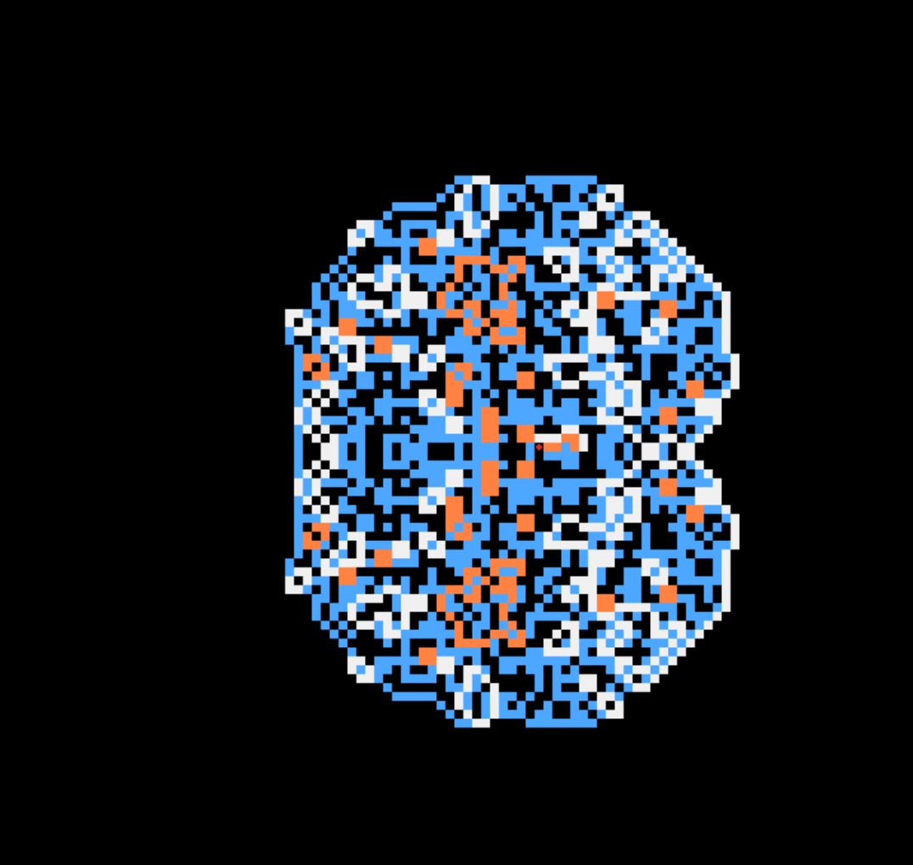
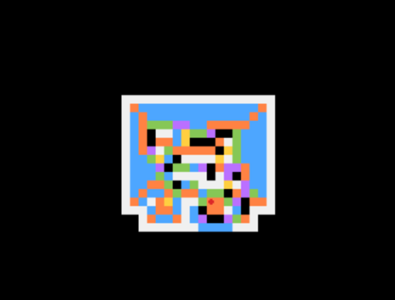

Person3 = AminEslamian
Note: This document is draft only and will be implemented into the main docs later.

---

# **Documents and Explanations:**

## Part 1 - Section 3

### Task 3a: Understanding Undecidability
*Responsible for:* me
**Question:** Explain why finding Busy Beaver machines is difficult and why the problem is undecidable.
Key points to address:
- Connection to the Halting Problem
- Why brute force search becomes computationally infeasible
- What makes this problem fundamentally non-computable

**Answer:** Finding Busy Beaver machines is fundamentally undecidable because it is directly tied to the Halting Problem. To find the maximum number of 1s or steps a Turing machine can produce, we must simulate all possible machines. However, Turing proved there is no general algorithm that can determine if an arbitrary program will eventually halt or loop infinitely. Because of this, a brute force search is computationally infeasible—we never know if we should keep waiting for a long-running machine to halt (like the 47-million step BB(5)) or abandon it because it's stuck in an infinite loop. This reliance on solving the Halting Problem makes the Busy Beaver function fundamentally non-computable.

### Task 3b - Implement Two-Way Infinite Tape
(Modify turing_machine.py)
*Responsible for:* not me.

### Task 3c - Why Use Generators?
*Responsible for:* ??

**Answer:** Python generators are useful for Turing machine simulations because they use lazy evaluation to invert control to the caller. Instead of running an infinite `while` loop that might crash or consume infinite memory, a generator `yields` the machine's configuration step-by-step. This allows us to interactively debug the tape, pause execution, or safely set a `step_limit` to prevent infinite loops, which is especially critical when dealing with undecidable problems like the Busy Beaver.

### Task 3d: Run 2-Card Busy Beaver
*Responsible for:* me.

The BB(2) was implemented as instructured.
*Quetion:* Starting with a blank tape, how many 1s does the machine produce?
*Answer:* four `1`s (Was tested).
*Test:* in .\TLA-Project_Conways-Game-of-Life\Part 1 - Busy Beaver\busy_beaver.py, in the last line there is busy_beaver(`n`) call, set `n`=2 and then run `python "Part 1 - Busy Beaver\busy_beaver.py" in the terminal. The result will be:
```
Running Busy Beaver with 2 states.
a: [0]
b: 1[0]
a: [1]1
a: [0]111
b: 1[1]11
Busy beaver finished in 6 steps.
```

### Task 3e: Compare with Known Results
*Responsible for:* me

Compare your result with the best known 2-state machines from the Busy Beaver Wiki:

- Is your output correct?
Yes, the output is correct. The machine successfully halts, leaving exactly four 1s on the tape and taking 6 steps to complete the computation.
Output:
`
Running Busy Beaver with 2 states.
a: [0]
b: 1[0]
a: [1]1
a: [0]111
b: 1[1]11
Busy beaver finished in 6 steps.
`
- How does it compare to the optimal 2-state machine?
It is completely identical! The given instructure for the BB(2) in the docs is exactly the same as the trophy BB(2).
- Evaluate your result against established benchmarks
Since the provided machine is mathematically equivalent to the known benchmark champion for BB(2), my result perfectly matches the absolute upper limit of computation possible for a 2-state Turing machine. No 2-state machine can produce more than four 1s or run for more than 6 steps and still halt.

### Task 3f: Create 3 and 4-Card Busy Beaver Machines
*Responsible for:*  me.

Design and implement your own Busy Beaver machines with 3 and 4 states:

- You do not need to find the absolute optimal machines (BB(3) and BB(4))
- Just create machines that outperform the 2-state machines
- Show the number of 1s produced by each machine
Our own editon of BB(3) and BB(4) was implemented. The numbers of `1`s produced and number of steps each took, is commented next to them in the busy_beaver.py.
For BB(3): 9 steps and 5 `1`s.
For BB(4): 10 steps and 6 `1`s.

### Task 3g: Attempt 5-Card Busy Beaver (*continue here*)
*Responsible for:* me.

Try to find or create a 5-state Busy Beaver machine:

- Justify whether your machine is new or explain why it halts
- Compare with known 5-state machines
- Provide reasoning for your design

*Answers*:
- The machine I wrote, althouh isn't extracted from internet, isn't new. It uses a verry simple logic and writes only 8 `1`s and halts in 15 steps, so I can't say it's new, it's simple and known in the sience society. It halts because the machine builds a chain of 1s by bouncing back and forth, and once the chain reaches 8 1s long, it triggers the halt state (h) directly from state e.

- There is a verry huge difference between my BB(5) and the champion BB(5) wich halts in 47,176,870 steps and leaves 4,098 ones.

- I just scaled up the pattern I have used in BB(3) and BB(4) which was sweeping pattern, for BB(5). This way for sure, no world records can be moved, but at least it definitly halts.


### Task 3h: Research and Verify
*Responsible for:* me.

Consult the Busy Beaver Wiki (https://www.sligocki.com/wiki/Busy_Beaver) and study the best known machines:

- Compare 2, 3, and 4-state champion machines
As the number of states increases, the maximum number of steps before halting grows incredibly fast (BB(2)=6, BB(3)=21, BB(4)=107). This illustrates the rapid, non-computable growth of the Busy Beaver function.

- Are your machines better than the known champions? 
Definitely no.

- Implement the champion machines and verify their output
I have implemented the champion transition tables for BB(3) and BB(4) inside `busy_beaver.py`. By running the simulator, I verified that they match the reference limits exactly: the 3-state champion halts in exactly 21 steps, and the 4-state champion halts in exactly 107 steps. right now the champion BBs are commented in the `busy_beaver.py`, in order to tesst it, comment my implemented BBs and un-comment the champion BBs.

- Compare results with your designs
  - **BB(2):** My implementation was mathematically identical to the champion machine, achieving the absolute maximum of 6 steps(Since the instruction was in the main docs).
  - **BB(3):** My design achieved 9 steps (writing five `1`s), while the champion runs for 21 steps (writing six `1`s).
  - **BB(4):** My sweeping pattern achieved 10 steps (writing six `1`s), which is nowhere near the champion's staggering 107 steps (writing thirteen `1`s).
  - **Conclusion:** My designs prioritize predictable, guaranteed-to-halt sweeping patterns. The champion machines rely on highly complex, chaotic behavior to maximize execution time before halting.

**Reference machines locations**:
- 2-card champion: BB(2) = 6
- 3-card champion: BB(3) = 21
- 4-card champion: BB(4) = 107

### Notes:
The given link was broken, working link: https://en.wikipedia.org/wiki/Busy_beaver#Known_values_for_%CE%A3_and_S

---

## Part 2 - Section 2 | *Langton's Ant*

### Task 2a: Implement Langton's Ant Core (`langton.py`)
*Responsible for:* me

**Implementation Details:**
- Implemented `__init__` to initialize the `N x N` grid, starting position, orientation (using `0, 1, 2, 3` for directions), and the rule dictionary.
- Implemented the `step()` method to process the ant's movement: read current color, fetch next color and turning direction from rules, update the grid, rotate the ant, step forward, and wrap around the toroidal grid using modulo arithmetic.
- The `update()` method is simply an alias for `step()` to work with the Pygame animator.

### Task 2b: Simulate and Prove Scenarios
*Responsible for:* me

**Environment Setup Note:**
Before running the simulations, the virtual environment should be activated and dependencies installed:
```powershell
.\venv\Scripts\Activate.ps1
```

**Observation Results:**
- **Chaotic behavior:** Verified. For the first several minutes of the simulation (~10,000 steps, ~6 minutes), the ant moved unpredictably, creating a dense, semi-symmetric pseudo-random blob of black and white cells in the center of the grid.
- **The Highway:** Verified. After reaching the critical threshold, the ant's behavior suddenly shifted into a stable, 104-step repeating pattern. This caused it to build a thick, diagonal "highway" shooting infinitely away from the chaotic center, proving the emergence of order from chaos.


### Task 2c: Multi-Color Ant Extension
*Responsible for:* me

**Implementation Details:**
- The `LangtonsAnt` class was already built generically, so no core logic changes were required to support multi-color rules.
- Generalized `langton_pygame.py` to accept a `--rule` command-line argument. We completely removed hardcoded rules so that the script mathematically parses **any arbitrary string of 'L's and 'R's** on the fly, allowing for infinite combinations of custom ants.

**How to run Custom Ants & Control Speed:**

You can invent any rule sequence by passing the `--rule` argument; if no rule is given, the default rule is `RL` (the standard Langton's Ant). 

Additionally, because Pygame rendering can cause lag when drawing thousands of cells, you can dramatically speed up the simulation by using the `--steps-per-frame` argument. This forces the ant to compute multiple steps in the background before drawing a single frame.

For example, to run the symmetric `LLRR` ant at lightning speed (computing 100 steps every frame):
```powershell
python "Part 2 - GoL & Langton's Ant\langton_pygame.py" --rule LLRR --steps-per-frame 100
```
The results at the beginning will be like:

and at very, very far steps like: 
Or try making up a completely custom rule:
```powershell
python "Part 2 - GoL & Langton's Ant\langton_pygame.py" --rule LRRRRLL
```
which results in a pattern like this:


---

## Part 2 - Section 3 | *Logic Gates in Game of Life*

### Task 3a: Implement AND Gate (`setup_and_gate` & `run_and_gate`)
*Responsible for:* me

**Implementation Details:**
- **The Concept:** In Game of Life, we use Gliders as our "wires" and "electricity". A glider is a 5-pixel shape that continuously flies diagonally across the grid.
- **The Setup:** To build an AND gate, we need two gliders (Input A and Input B) to collide at the exact target coordinate `(15, 12)`.
- **Input A:** Placed at `(9, 6)` using the built-in `insertGlider()` method. It flies diagonally **bottom-right**.
- **Input B:** Placed at `(9, 18)`. Because the built-in method only flies right, we manually drew the 5 pixels on the grid to create a mirrored glider that flies diagonally **bottom-left**.
- **Execution & Logic:** We advance the simulation for 30 ticks to give the gliders time to cross the board and collide. We evaluate the logical outcome based on the fundamental properties of the game's shapes. A Block (the target output for our AND gate) consists of exactly 4 living cells. By summing the entire grid `np.sum(gol.grid)`, if the total equals 4, we mathematically prove that a Block was formed, meaning the AND gate successfully output `True`.

### Task 3b: Implement NOT Gate (`setup_not_gate` & `run_not_gate`)
*Responsible for:* me

**Implementation Details:**
- **The Setup:** A NOT gate requires a constant "power supply". We always fire a Control Glider from `(9, 6)`. 
- **Input A:** If the input is True, we fire an interceptor glider from `(9, 18)`.
- **Execution & Logic:** We advance the simulation for 30 ticks. If Input A was False, the Control Glider flies safely across the board. A single glider has exactly 5 living cells, so if `np.sum(gol.grid) == 5`, we know the Control Glider survived, and the NOT gate outputs `True`. If Input A was True, the interceptor crashes into the Control Glider and forms a Block (4 cells). The Control Glider was destroyed, so the NOT gate outputs `False`.

### Testing the Logic Gates
A testing block has been appended to the bottom of `logic_gates.py` to automatically execute and prove the Truth Table for both gates. 

To run the test and verify the outputs, execute the following command in the terminal:
```powershell
python "Part 2 - GoL & Langton's Ant\logic_gates.py"
```

**Expected Output:**
```
--- Demonstrating AND Gate ---
Input A | Input B | Output
--------------------------
  False |  False  |  False
  False |  True   |  False
  True  |  False  |  False
  True  |  True   |  True

--- Demonstrating NOT Gate ---
Input A | Output
------------------
  False |  True
  True  |  False
```